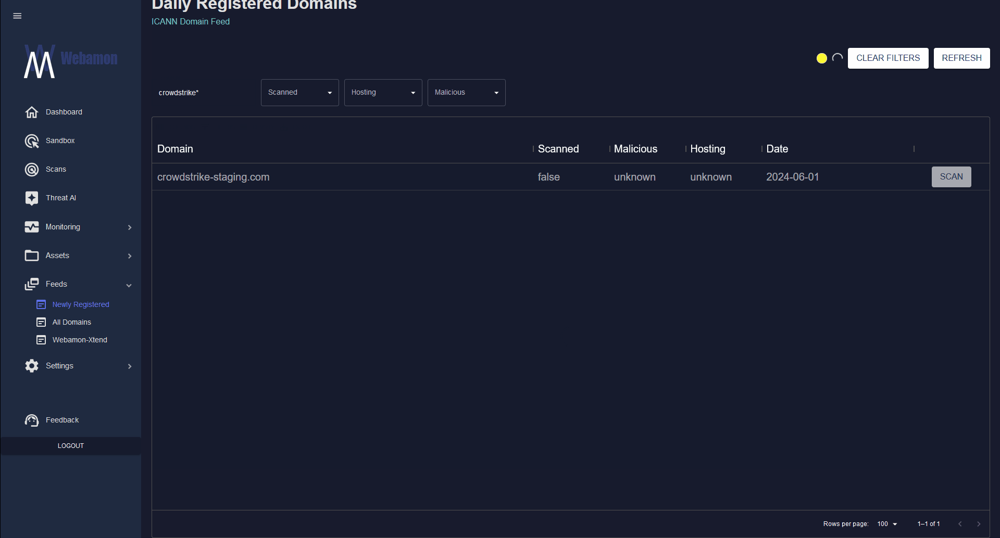
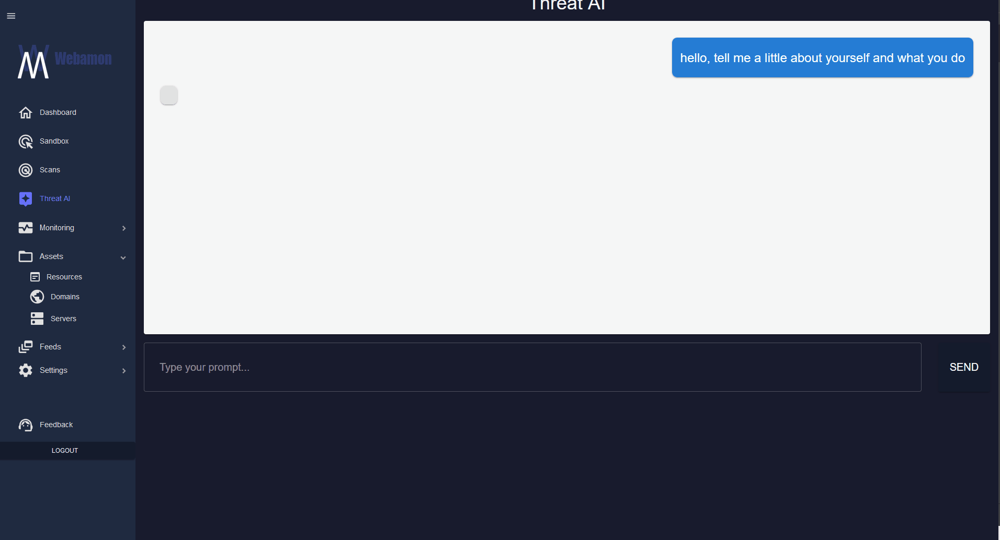

# Webamon - Democratizing Threat Intelligence


## Warning

**Before running, ensure you have a VPN running either locally or on your router. Failure to do so may expose your public IP address, which could compromise your privacy and security.**
**Join the Democracy →** [hunt.webamon.co.uk](https://hunt.webamon.co.uk)

## Overview

Welcome to **Webamon**, where we believe in the power of community-driven threat intelligence. Our mission is to **democratize threat intelligence**, making it accessible, collaborative, and secure for everyone. This open-source community release provides a platform where users can contribute, share, and benefit from collective knowledge, strengthening global cybersecurity efforts.


## Features

### **Sandbox Web Scanner**

### **Newly Registered Domains Feed**

### **Xtended & Enriched Community Feeds**

### **The Internets Asset Directory (web resources, domains, servers)**

### **Threat-AI Large Language Model (Mistral)**



## Getting Started

1. **Sign Up**: Create your Webamon account at [hunt.webamon.co.uk](https://hunt.webamon.co.uk) to join the community.
2. **Explore**: Use the Webamon console to explore community-contributed threat intelligence.
3. **Contribute**: Share your scan results with the community anonymously, helping to build a more secure digital world.

## Contribute

We welcome contributions from everyone! Whether it's reporting bugs, suggesting features, or sharing your own intelligence data, your involvement helps make Webamon better for all.

## Community & Support

Join our community  at [hunt.webamon.co.uk](https://hunt.webamon.co.uk) for discussions, support, and more.

## License

This project is licensed under the Apache 2.0 License. See the [LICENSE](LICENSE) file for details.


## Installation and Setup

### 1. Clone the Repository

First, clone the repository to your local machine:

```bash
git clone https://github.com/webamon-org/Democracy.git
cd Democracy
#add your "webamon_apikey" to docker-compose.yml
docker-compose up
#navigate to localhost:3000


